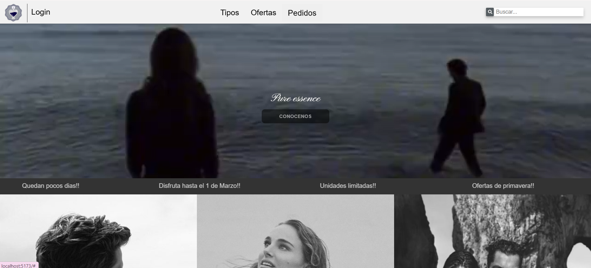
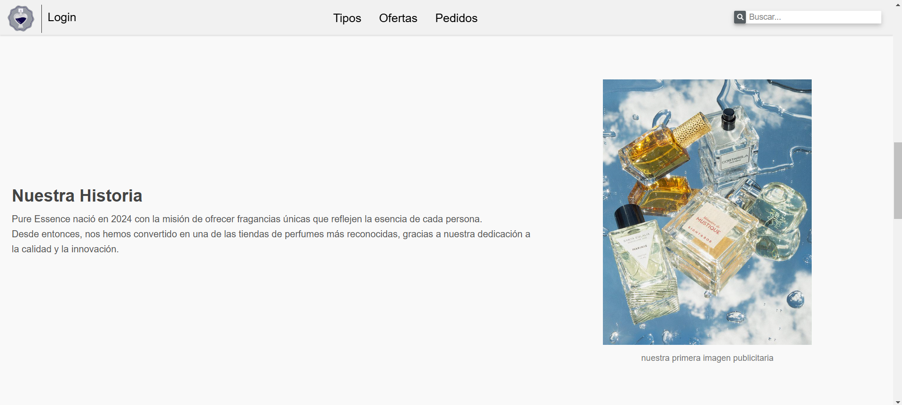
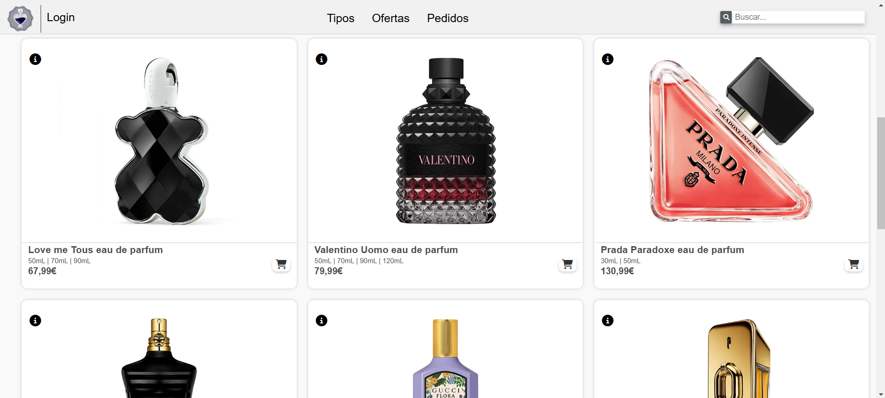
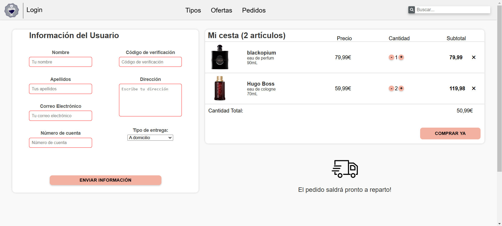

# 🌿 Tienda de Perfumes - Proyecto Web



## 📚 Descripción del Proyecto

Este es un proyecto web basado en una **tienda de perfumes**, desarrollado con el objetivo de practicar y mejorar conocimientos en **HTML, SCSS y JavaScript**. La tienda permite a los usuarios explorar diferentes perfumes, ver detalles de cada producto y realizar compras ficticias.

## 💪 Tecnologías Utilizadas
- **HTML5**: Para la estructura del sitio web.
- **SCSS**: Para el diseño y estilizado con preprocesadores CSS.
- **JavaScript**: Para la interactividad y la manipulación del DOM y para poder añadir ciertas funcionalidades que 
únicamente con scss no eran posibles de realizar.

## 🔍 Características Principales
- **Diseño Responsivo**: Compatible con dispositivos móviles y escritorios.
- **Catálogo de Perfumes**: Lista de productos con imágenes y descripciones.
- **Carrito de Compras**: Simulación de agregar y eliminar productos.
- **Filtros de Búsqueda**: Para encontrar perfumes por género.

## 📖 Secciones del Sitio Web
1. **Inicio** - Presentación de la tienda y promociones destacadas.
2. **Catálogo de Perfumes** - Listado de perfumes disponibles.
3. **Detalles del Producto** - Información detallada de cada perfume.
4. **Carrito de Compras** - Vista de los productos agregados al carrito.
5. **Contacto** - Formulario para enviar consultas.

## 📷 Capturas de la Interfaz
### Inicio


### Catálogo de Perfumes


### Carrito de Compras


## 🚀 Cómo Interactuar con la Tienda
1. **Explorar el Catálogo**: Navega por los productos disponibles.
2. **Agregar al Carrito**: Haz clic en el icono de "Agregar al Carrito" para seleccionar un perfume.
3. **Ver Carrito**: Revisa los productos seleccionados y ajusta cantidades.
4. **Finalizar Compra**: Simula la compra con un resumen del pedido.

## 💻 Instalación y Ejecución
Si deseas clonar el proyecto en tu computadora, sigue estos pasos:

```bash
# Clonar el repositorio
git clone https://github.com/IreneEducamadrid/AprendizajeGitAdaIrene.git

# Entrar al directorio del proyecto
cd trabajosassirenesmykla

# Abrir en el navegador
npm run dev
```

# 💌 Contribución

Si deseas mejorar este proyecto, puedes hacer un fork y enviar tus sugerencias o mejoras a través de un pull request.

# 👥 Autor

Irene Smykla y Adalberto Carrasco - Desarrolladores del Proyecto.

📡 Enlace al Repositorio

[Repositorio en GitHub](https://github.com/IreneEducamadrid/AprendizajeGitAdaIrene.git)
